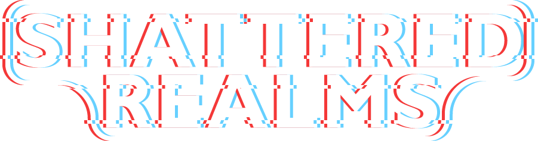

# Overview
Shattered Realms is currently split into 7 different repositories which is continuing to grow.
- [Accounts](https://github.com/ShatteredRealms/Accounts): Microservice managing user account authentication and authorization written in Golang.
- [Characters](https://github.com/ShatteredRealms/Characters): Microservice managing player characters.
- [Chat](https://github.com/ShatteredRealms/Chat): Microservice managing chat messages written in Golang.
- [Documentation](#): Documentation and planning across all Shattered Realms projects.
- [Frontend](https://github.com/ShatteredRealms/Frontend): Website for Shattered Realms written in TypeScript using Angular.
- [Game](https://github.com/ShatteredRealms/ShatteredRealms_Game): Game client and server written in C++ using Unreal Engine 5.
- [Game Backend](https://github.com/ShatteredRealms/GameBackend): Microservice backend for the game written in Golang.
- [Launcher](https://github.com/ShatteredRealms/Launcher): Game client launcher written in TypeScript using Electron.

# Deployment
Deployment configurations are assuming AWS, but other cloud providers can be used with slight modifications.

## Requirements
All commands and scripts and commands are currently written in UNIX bash format. The following applications are needed:
1. kubectl
2. helm
3. openssl
4. aws
5. istioctl

## Deployment Order
To deploy smoothly, use the following order:
1. Global
2. Networking
3. Database
4. Services